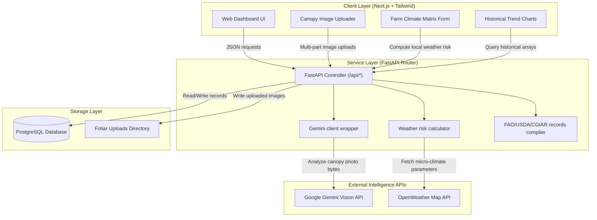
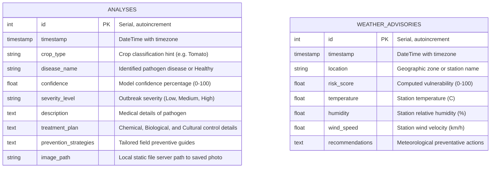

# BotanIQ: System Architecture & Database Schema

This document details the system design, communication pipelines, and database relations for the BotanIQ Crop Disease Intelligence Platform.

---

## 1. System Architecture Diagram

The BotanIQ platform uses a decoupled Client-Server architecture. The Next.js frontend handles visualizations and user interactions, while the FastAPI backend handles calculations, database persistence, and external service calls.

---

## 2. Database Schema ERD

BotanIQ uses a relational database schema structured in PostgreSQL to store diagnostics history and weather logs.

